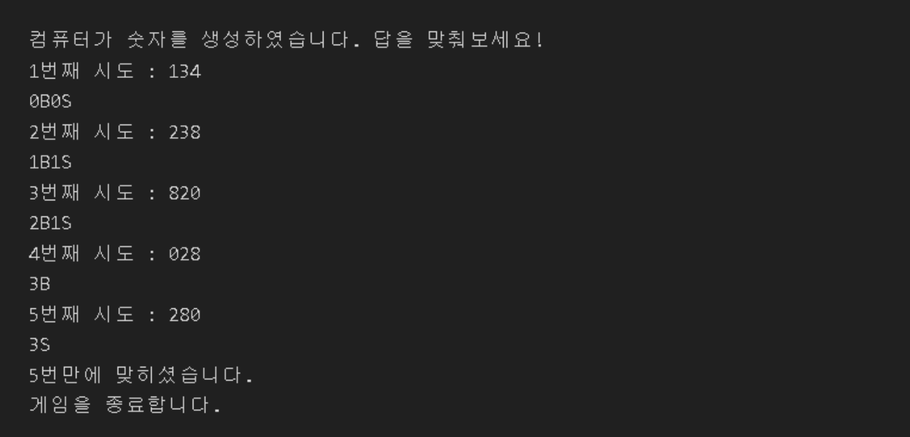

# practice vanillajs

- `📁 baseball.js` : 숫자야구게임

 

   

  > 컴퓨터는 0과 9 사이의 **서로 다른 숫자** 3개를 무작위로 뽑습니다. 
  >  
  > ex. 123, 579
  >  
  > 사용자는 컴퓨터가 뽑은 숫자를 맞추기 위해 시도합니다.
  >  
  > 컴퓨터는 사용자가 입력한 세 자리 숫자에 대해서, 아래의 규칙대로 스트라이크(S)와 볼(B)을 알려줍니다.
  >  
  >
  > - 숫자의 값과 위치가 모두 일치하면 S
  > - 숫자의 값은 일치하지만 위치가 틀렸으면 B
  >    
  >
  > 기회는 무제한이며, 몇 번의 시도 후에 맞췄는지 기록됩니다.
  >  
  > 숫자 3개를 모두 맞춘 경우 게임을 종료합니다.
  >  
  > 조건문, 반복문을 활용하여 해결합니다.
  >  
  
  1. 랜덤한 숫자 만들기
  2. 한자리 숫자에 대해 볼, 스트라이크 구분하는 함수 만들기
  3. 볼, 스트라이크를 표현하는 부분 구현하기
  4. 게임 종료하는 부분 구현하기